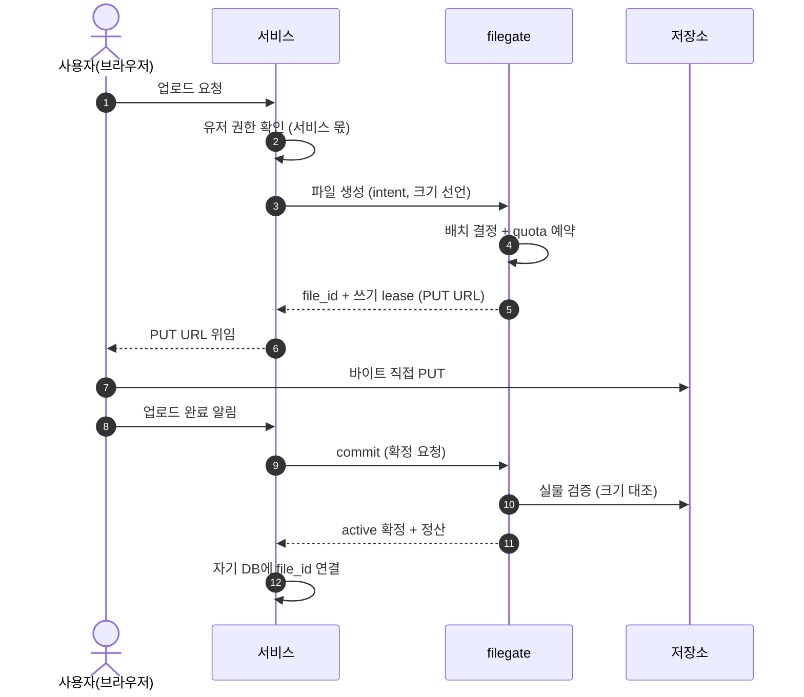

# ADR 002: 모든 바이트 접근은 lease다

- Status: Draft (최초 작성)
- Date: 2026-07-03
- 부모: [000](000-identity.md) 공리 2 (바이트 직결이 기본)

## 문제

바이트를 보지 않는 filegate가 접근을 어떻게 허가·기록·검증하나. S3 API 흉내(facade)는 기각 — 바이트 프록시를 강제하고, intent를 표현할 자리가 없다. 서명 URL을 그대로 쓰면: 크기를 강제 못 하고, 전송 완료를 모르고, 업로드/다운로드 개념이 분열된다.

## 결정

- **lease = 시간제한·취소가능·단일목적 접근 권한.** 쓰기, 읽기, 최종 사용자 위임까지 — 저장소에 닿는 모든 접근이 이것 하나를 통한다.
- **쓰기는 2단계: 허가 → 확정.** 발급 시 quota 예약, 클라이언트가 직접 업로드, 확정(commit) 시 filegate가 실물을 대조(크기·완결성)하고 정산. **확정이 검증 게이트다** — 허가가 강제 못 하는 약속을 여기서 걸러내고, 확정 못 한 바이트는 파일이 되지 못하며 회수된다.
- **읽기는 간접층.** 매 발급마다 파일의 *현재* 위치를 재해석한다. 위치 이동과 안정적 접근이 양립하는 유일한 방법.
- **접근 수단의 발급자는 capability의 함수다.** 기본은 저장소가 발급한 직접 접근(presigned). 저장소가 그것을 제공하지 못하면(presigned 불가·CORS 불가) filegate가 자체 바이트 엔드포인트를 발급한다(**중계 모드**). 어느 쪽이든 서비스가 보는 계약(발급→전송→확정)과 검증·회계는 동일하다 — 서비스는 받은 URL이 어디를 가리키는지 몰라도 된다. 중계가 서비스가 아니라 filegate에 사는 이유: 폴백 배관을 서비스마다 재구현하게 하면 공리 1의 정신이 깨진다.
- **lease가 유일한 감사 단위.** 접근 추적, 고아 탐지("만료 + 미확정"), 감사 기록이 전부 lease 하나에서 나온다. 생애: 발급 → 확정 | 만료 | 취소.
- **보안 = capability.** 검문은 발급 *앞*에 있다(서비스의 유저 권한 검사 + filegate의 client 검사). 열쇠는 짧고 좁게 — 객체 하나, 동작 하나, 분 단위. 파일이 공개되는 게 아니라 그 파일로 통하는 문이 잠깐 생겼다 사라지는 것이다.

## 흐름 — 업로드 (쓰기 lease)

컨트롤(얇은 화살표)은 항상 인증 뒤에 있고, 바이트(7)는 filegate도 서비스도 지나지 않는다. 사용자↔filegate 채널은 존재하지 않는다.

6에서 서비스가 위임하지 않고 직접 PUT하는 변형(서버측 업로드)도 유효하다 — 바이트가 filegate를 안 지나는 것은 동일하다.

## 경계선

- 실사용 시점은 모른다 — 저장소가 알려주지 않으므로 "사용됨" 상태는 없다.
- **브라우저 위임 쓰기는 저장소의 CORS 지원이 전제다.** CORS는 provider capability로 선언하고, 미지원이면 중계 모드로 폴백한다 (filegate는 자기 CORS를 스스로 제어한다).
- **중계 모드는 예외이지 두 번째 기본값이 아니다.** filegate에 전송 비용과 가용성 결합을 얹으므로, capability가 강제할 때만 쓰고 직결 가능한 저장소에서 편의로 켜지 않는다. 중계 URL도 lease가 담긴 capability 토큰이다 — 짧고 좁은 것은 동일하다.
- 취소는 나간 열쇠를 되부르지 못한다 — 실효는 "확정 거부 + 만료 후 회수". 그래서 TTL 짧게가 기본 철학.
- 읽기는 용량을 소비하지 않는다. 용량 = 물리적 점유(purge 전까지).
- 갱신·재개(resumable)는 필요가 증명될 때 lease의 확장으로.

## 결과

- API 표면 4개로 유지: 허가(쓰기/읽기), 확정, 조회, 삭제 결정.
- 요청 경로는 얇게(정책→배치→발급→기록), 무거운 일(회수·검증·보존 집행)은 reconciler로.
- filegate 장애에도 발급된 접근과 진행 중 전송은 계속된다.
- 서비스는 접근 수단을 불투명하게 취급한다. URL 구조 의존은 계약 위반.
