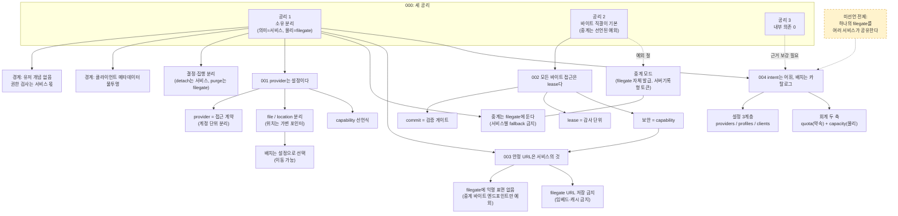
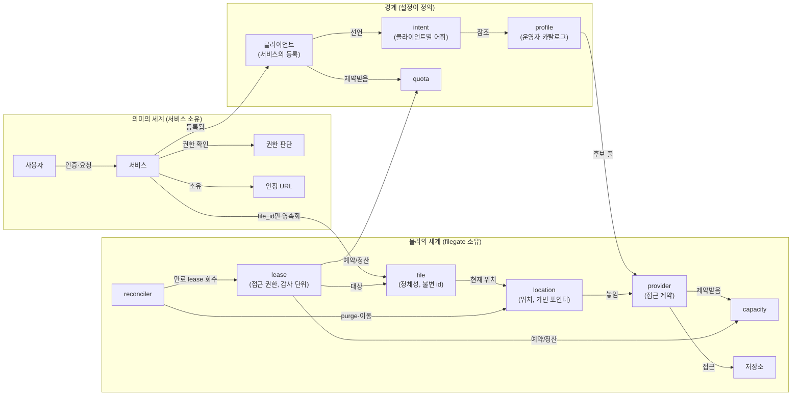

# ADR 논리 그래프

ADR의 논리 구조를 두 그래프로 정리한다. 파생 그래프는 공리와 결정의 관계를, 개념 온톨로지는 용어 간 관계를 보여준다. 그래프와 ADR 본문이 다르면 ADR 본문을 기준으로 한다.

## 1. 파생 그래프: 공리 → 결정 → 경계

읽는 법: 실선은 문서에 근거가 있는 파생 관계다. 점선은 예외 또는 근거 보강이 필요한 관계다. 004의 "여러 서비스 공유" 전제는 아직 공리에 명시되어 있지 않다.

## 2. 개념 온톨로지: 용어와 관계

## 3. 관계 트리플 (온톨로지 정본)

| 주어 | 관계 | 목적어 | 출처 |
|---|---|---|---|
| 서비스 | 소유한다 | 파일의 의미 (귀속·권한·삭제 결정) | 000 공리 1 |
| filegate | 소유한다 | 파일의 물리 (위치·보존·집행) | 000 공리 1 |
| 서비스 | 영속화한다 (유일하게) | file_id | 000, 003 |
| 클라이언트 | ~이다 | 서비스의 등록 단위 | 용어집 |
| 클라이언트 | 선언한다 | intent (자기 네임스페이스) | 004 |
| intent | 참조한다 | profile | 004 |
| profile | 정의한다 | 배치 후보 풀 + 수명 정책 | 004, 001 |
| provider | ~이다 | 접근 계약 (벤더+계정+주소+자격증명+공간) | 001 |
| file | 가리킨다 (가변) | location | 001 |
| lease | 유일하게 매개한다 | 저장소에 닿는 모든 접근 | 002 |
| lease | 예약·정산한다 | quota와 capacity 양쪽 | 004 |
| 확정(commit) | 검증한다 | 선언 vs 실물 | 002 |
| reconciler | 유일하게 집행한다 | 물리 상태 변경 (회수·purge·이동) | 001, 002 |
| 중계 모드 | ~이다 | 공리 2의 선언된 예외 (capability가 강제할 때만) | 000, 002 |
| 안정 URL | 있다 | 서비스 도메인에 | 003 |
