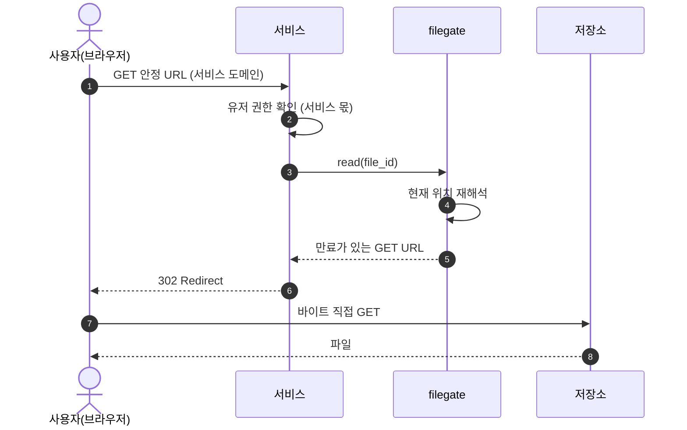

# spec 00: 단일 파일 오퍼레이션

- Status: Draft
- Date: 2026-07-07
- 근거: ADR [000](../adr/000-identity.md), [001](../adr/001-multi-storage.md), [002](../adr/002-lease-model.md), [003](../adr/003-url-ownership.md), [004](../adr/004-config-layers.md)
- 실측: 2026-07-08, MinIO 싱글노드. "(실측)"은 이 확인에서 나온 사실이다.

단일 파일 업로드·다운로드, 그에 필요한 조회·삭제, 운영자 용량 조회를 정한다.

## 범위

이번 범위: `create`→`commit`(업로드), `read`(다운로드), `stat`, `delete`, `usage`(운영자).

접근 모드는 둘 다 구현되어 있다 — **직결**(저장소 presigned URL)과 **중계**(filegate 바이트 엔드포인트). 서비스 계약은 두 모드에서 같고(ADR 001·002), 모드는 storage 선언이 정한다: fs는 항상 중계, s3는 기본 직결에 `force_relay`로 중계 강제(CORS 없는 벤더, 사설망 뒤 저장소).

다음 범위로 미룬다:

- OCI 등 외부 벤더 추가.
- 폴더·배치 업로드 — 폴더는 서비스가 단일 업로드를 반복해 표현한다 (공리 1).
- 갱신·재개(resumable) 업로드.
- 5GiB 초과 파일 — multipart는 ETag가 MD5가 아니라 체크섬 대조가 단일 PUT에서만 성립한다 (실측).
- 명시적 lease 취소 — pending은 lease 만료로 회수한다.
- 위임 토큰.
- 클라이언트별 quota 집행 — 도입해도 운영자 내부 가드레일이며 클라이언트에 노출하지 않는다.

## 공통 원칙

- 권한 검사는 서비스가 호출 전에 한다. 유저 개념은 서비스에 있다 (공리 1).
- 바이트는 전송 주체와 저장소가 직접 주고받고, filegate는 발급·기록·검증을 한다 (공리 2). 직결이 불가능한 storage는 filegate가 중계하며, 계약은 같다.
- 서비스는 filegate 산출물 중 file_id만 영속화한다 (ADR 003).
- 모든 표면은 인증 뒤에 있다: 클라이언트 API는 클라이언트 인증, usage는 운영자 인증, 중계 바이트 엔드포인트는 lease별 secret (ADR 003).
- 용량은 운영자의 세계다. 클라이언트는 어떤 오퍼레이션에서도 용량 정보를 받지 않고, 자기 사용량은 스스로 관리한다 (공리 1). 이번 범위 회계는 capacity(storage별 물리 총량) 한 축이다.

## 오퍼레이션

### create — 쓰기 lease 발급

- 입력: intent, 선언 크기. 선택: content_type, 선언 MD5. 0바이트도 유효한 선언이다.
  - content_type은 서명에 포함해야 강제된다 (실측).
  - 선언 MD5는 commit이 ETag와 대조한다. 단일 PUT의 ETag = MD5다 (실측).
- 처리: 선언 해석 ((client, intent) → binding → storage — [spec 01](01-registry.md), v0는 명시 선언 단일 대상), capacity 예약, file_id 발급.
- 출력: file_id, 만료가 있는 PUT URL. URL 구조는 계약이 아니다 (직결이면 저장소 presigned, 중계면 filegate 엔드포인트).
- capacity는 경성 상한이다: `예약량 + 확정량 + purge 대기 점유 + 선언 크기`가 상한을 넘으면 발급을 거부한다. 대상 storage가 상한에 걸리면 create는 실패하고, 거부 이유의 용량 상세는 클라이언트에 노출하지 않는다.
- 상태: `pending`. commit 전까지 파일이 아니다.

### commit — 업로드 확정

- 입력: file_id.
- 처리: 저장소 실물 크기를 선언 크기와 대조하고, 선언 MD5가 있으면 ETag와도 대조한다. 확정 시점 ETag를 기록하고 정산한다.
- 상태: `pending` → `active`. 검증 실패면 `pending`에 남아 lease 만료까지 재시도할 수 있다.
- 쓰기 URL은 확정 후에도 만료 전까지 유효하다 (실측). 쓰기 TTL을 짧게 두고, 변조 의심은 기록된 ETag로 판정한다.

### read — 읽기 lease 발급

- 입력: file_id. 선택: 표현(파일명·표시 방식) — RFC 5987(`filename*=UTF-8''…`)로 인코딩한다 (ADR 003, 실측).
- 처리: 현재 location을 재해석한다 (이동해도 같은 file_id로 접근).
- 출력: 만료가 있는 GET URL. 서비스가 302 redirect한다. 읽기는 용량을 소비하지 않는다.

### stat — 메타데이터 조회

- 입력: file_id. 클라이언트는 자기 소유 file_id만 조회한다.
- 출력: 상태(`pending`|`active`|`deleted`), 크기, intent. (location·URL은 제외.)

### delete — 삭제 결정

- 입력: file_id.
- 처리: 서비스의 detach 결정을 기록한다. 물리 purge는 reconciler가 요청 경로 밖에서 집행한다 (공리 결정·집행 분리).
- 상태: `active` → `deleted`. 이후 read·commit은 실패한다.
- purge는 멱등하다 (실측). capacity는 purge 시점에 해제한다.

### usage — 운영자 용량 조회

- 운영자 표면이다. 클라이언트 자격증명으로는 호출할 수 없다.
- 출력: storage별 capacity 한도, 예약량(pending 합), 확정량(active 합), purge 대기 점유(deleted·미purge), 남은 여유(= 한도 − 앞의 셋).
- 이 총량이 배치 거부와 tiering 판단의 입력이다.

## 흐름: 업로드

직결 모드다. 중계 모드는 저장소(O) 자리에 filegate 바이트 엔드포인트가 서고 단계·계약은 같다.


## 흐름: 다운로드



## 상태

```text
create ──▶ pending ──commit──▶ active ──delete──▶ deleted ──purge──▶ (해제)
             │                                        (reconciler)
             └── lease 만료 ──▶ 회수
```

- `pending`: 발급됨·미확정, capacity 예약. 검증 실패한 commit도 여기 남아 만료 회수로 정리한다.
- `active`: 확정됨, read 가능.
- `deleted`: detach 결정됨, purge 전까지 capacity를 점유한다.
- capacity 해제는 두 지점이다: pending의 만료 회수, deleted의 purge. commit은 예약을 확정으로 정산한다.

## 경계선

- 업로드 한 번은 create·commit 두 호출이다.
- 직결 PUT은 크기를 앞단에서 막지 못한다 (실측). commit이 사후 검증 게이트다. 상한을 넘는 실물은 파일이 되지 못하고 reconciler가 회수하며, 회수 전까지 초과 바이트가 잠시 존재한다. 중계 모드는 선언 크기에서 스트림을 끊는다.
- 전송 주체는 Content-Length를 보낸다. 길이 미상(chunked) 전송은 저장소가 거부한다 (실측).
- 중계 바이트 엔드포인트(`/b/{lease}`)의 확정 사항: 인증은 lease별 secret(URL에만, 서버는 해시), Content-Length 필수(411)·선언 크기와 일치(400)·초과 시 스트림 차단(413), CORS 응대, fs는 임시 경로 + rename 원자성. 중계 쓰기는 스트림 중 크기·MD5를 직접 계산해 기록하고 commit이 그것을 대조한다.
