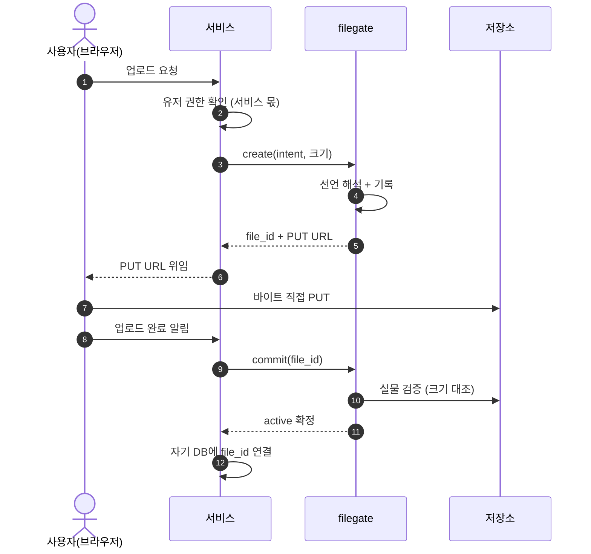
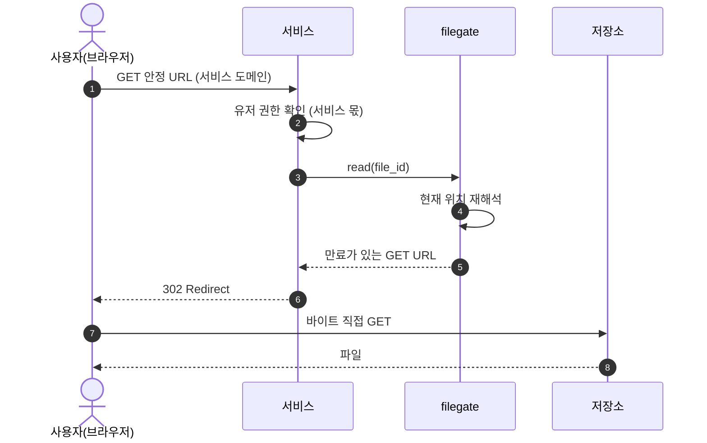

# spec 00: 단일 파일 오퍼레이션

- Status: Draft
- Date: 2026-07-07
- 근거: ADR [000](../adr/000-identity.md), [001](../adr/001-multi-storage.md), [002](../adr/002-lease-model.md), [003](../adr/003-url-ownership.md), [004](../adr/004-config-layers.md)
- 실측: 2026-07-08, MinIO 싱글노드. "(실측)"은 이 확인에서 나온 사실이다.

단일 파일 업로드·다운로드, 그에 필요한 조회·삭제, 운영자 용량 조회를 정한다.

## 범위

이번 범위: `create`→`commit`(업로드), `read`(다운로드), `stat`, `delete`, `usage`(운영자). 임계값을 넘는 대용량과 갱신·재개는 [spec 02](02-multipart.md)가 확장한다.

접근 모드는 둘 다 구현되어 있다 — **직결**(저장소 presigned URL)과 **중계**(filegate 바이트 엔드포인트). 서비스 계약은 두 모드에서 같고(ADR 001·002), 모드는 storage 선언이 정한다: fs는 항상 중계, s3는 기본 직결에 `force_relay`로 중계 강제(CORS 없는 벤더, 사설망 뒤 저장소).

다음 범위로 미룬다:

- OCI 등 외부 벤더 추가.
- 폴더·배치 업로드 — 폴더는 서비스가 단일 업로드를 반복해 표현한다 (공리 1).
- 명시적 lease 취소 — pending은 lease 만료로 회수한다.
- 위임 토큰.
- 클라이언트별 quota 집행 — 도입해도 운영자 내부 가드레일이며 클라이언트에 노출하지 않는다.

## 공통 원칙

- 권한 검사는 서비스가 호출 전에 한다. 유저 개념은 서비스에 있다 (공리 1).
- 바이트는 전송 주체와 저장소가 직접 주고받고, filegate는 발급·기록·검증을 한다 (공리 2). 직결이 불가능한 storage는 filegate가 중계하며, 계약은 같다.
- 서비스는 filegate 산출물 중 file_id만 영속화한다 (ADR 003).
- 모든 표면은 인증 뒤에 있다: 클라이언트 API는 클라이언트 인증, usage는 운영자 인증, 중계 바이트 엔드포인트는 lease별 secret (ADR 003).
- 용량은 운영자의 세계다. 클라이언트는 어떤 오퍼레이션에서도 용량 정보를 받지 않고, 자기 사용량은 스스로 관리한다 (공리 1). capacity는 집행이 아니라 **관찰**이다 — object storage는 탄력적이고 fs는 디스크가 스스로 실패를 내므로, filegate가 용량으로 발급을 거부하지 않는다. 사용량은 조회 시점에 files·locations에서 집계하고(저장 카운터 없음), 시계열은 대여 이력(lease_history, 3개월 보존)이 담당한다.

## 오퍼레이션

### create — 쓰기 lease 발급

- 입력: intent, 선언 크기. 선택: content_type, 선언 MD5. 0바이트도 유효한 선언이다.
  - content_type은 서명에 포함해야 강제된다 (실측).
  - 선언 MD5는 commit이 ETag와 대조한다. 단일 PUT의 ETag = MD5다 (실측).
- 처리: 선언 해석 ((client, intent) → binding → storage — [spec 01](01-registry.md), v0는 명시 선언 단일 대상), file_id 발급, 대여 이력 기록.
- 출력: file_id, 만료가 있는 PUT URL. URL 구조는 계약이 아니다 (직결이면 저장소 presigned, 중계면 filegate 엔드포인트).
- capacity로 발급을 거부하지 않는다 — capacity는 usage 조회의 관찰 기준선일 뿐이다. 물리 한계는 저장소가 낸다 (fs는 디스크 풀, object storage는 사실상 무한). 배치·정리 판단은 관찰을 본 운영자의 몫이다.
- 상태: `pending`. commit 전까지 파일이 아니다.

### commit — 업로드 확정

- 입력: file_id.
- 처리: 저장소 실물 크기를 선언 크기와 대조하고, 선언 MD5가 있으면 ETag와도 대조한다. 확정 시점 ETag를 기록한다.
- 상태: `pending` → `active`. 검증 실패면 `pending`에 남아 lease 만료까지 재시도할 수 있다.
- 쓰기 URL은 확정 후에도 만료 전까지 유효하다 (실측). 쓰기 TTL을 짧게 두고, 변조 의심은 기록된 ETag로 판정한다.

### read — 읽기 lease 발급

- 입력: file_id. 선택: 표현(파일명·표시 방식) — RFC 5987(`filename*=UTF-8''…`)로 인코딩한다 (ADR 003, 실측).
- 처리: 현재 location을 재해석한다 (이동해도 같은 file_id로 접근).
- 출력: 만료가 있는 GET URL. 서비스가 302 redirect한다. 읽기는 용량을 소비하지 않는다.

### stat — 메타데이터 조회

- 입력: file_id. 클라이언트는 자기 소유 file_id만 조회한다.
- 출력: 상태(`pending`|`active`|`deleted`), 크기, intent. (location·URL은 제외.)

### delete — 삭제 결정

- 입력: file_id.
- 처리: 서비스의 detach 결정을 기록한다. 물리 purge는 reconciler가 요청 경로 밖에서 집행한다 (공리 결정·집행 분리).
- 상태: `active` → `deleted`. 이후 read·commit은 실패한다.
- purge는 멱등하다 (실측). capacity는 purge 시점에 해제한다.

### usage — 운영자 용량 조회

- 운영자 표면이다. 클라이언트 자격증명으로는 호출할 수 없다. 읽기 전용 — 쓰기 표면은 Terraform 단독이다.
- storage별: capacity 한도, 예약량(pending 합), 확정량(active 합), purge 대기 점유(deleted·미purge), 남은 여유(= 한도 − 앞의 셋), 그리고 각 버킷과 짝을 이루는 파일 수(pending·active·purge 대기).
- (client × storage)별: 활성 점유(파일 수·바이트) — 여러 client가 한 storage를 공유할 때 각자의 몫을 가른다.
- 전부 조회 시점 집계다 (저장 카운터 없음). 이 관찰이 배치·tiering 판단의 입력이다.
- 일별 스냅샷(usage_snapshot): 점유(stock)의 과거는 소급 계산이 불가하므로(purge가 행을 지운다) reconciler가 매일 UTC 자정 이후 첫 tick에 어제 종점의 (storage×client) 활성 점유를 박제한다. 멱등이고, 이미 찍힌 날은 불변이다. 자정에 서버가 없었으면 첫 tick에 늦게 찍히는 근사치며, 통째로 놓친 날은 소급하지 않는다 — 지어낼 수 없는 값이다. flow(대여) 시계열은 lease_history 몫. 조회는 `/admin/usage/history?days=N`.

## 흐름: 업로드

직결 모드다. 중계 모드는 저장소(O) 자리에 filegate 바이트 엔드포인트가 서고 단계·계약은 같다.



## 흐름: 다운로드



## 상태

```text
create ──▶ pending ──commit──▶ active ──delete──▶ deleted ──purge──▶ (해제)
             │                                        (reconciler)
             └── lease 만료 ──▶ 회수
```

- `pending`: 발급됨·미확정. 검증 실패한 commit도 여기 남아 만료 회수로 정리한다.
- `active`: 확정됨, read 가능.
- `deleted`: detach 결정됨, purge 전까지 실물이 남는다.
- 관찰량에서 빠지는 지점은 location 제거다: pending의 만료 회수, deleted의 purge — "남은 location = 현재 점유"라 별도 정산이 없다.

## 물리 배치와 이름 규약

키는 만들 때 규칙으로 조합하고, **location 행에 저장한다**. 읽기·삭제는
항상 저장된 키를 따른다 — 규칙이 바뀌어도 기존 객체는 영원히 동작한다.
DB의 ID는 평범하게 둔다(uuid v4) — 정보 압축은 전부 경로·이름 계층의 일이다.

```text
s3 계열:  fg/{client}/{yyyy}/{mm}/{file_id}[.ext]
fs:       fg/{client}/{yyyy}/{mm}/{zz}/{file_id}[.ext]
임시:     .fg-tmp-{lease_id}-{랜덤}   (fs root 또는 OS temp의 스풀)
```

- **날짜는 create 시각, UTC** — pod 타임존과 무관하게 같은 파일은 같은 경로다.
- **zz = file_id 마지막 2 hex** — fs 한 디렉토리에 파일이 무한히 쌓이는 것을
  막는 팬아웃(월 안에서 256칸). id만으로 재계산 가능하다. s3 계열은 평면
  그대로다 — 접두사 핫파티션은 2018년 이후 근거가 없다 (조사 확인).
- **.ext는 허용목록 매핑만** — `image/png → png` 식 고정 표. content_type
  문자열을 자르지 않는다(경로 오염 차단). 모르는 타입은 확장자 없음.
  확장자는 선언의 반영일 뿐 검증된 사실이 아니다.
- 파일명(원본)은 키에 넣지 않는다 — 파일명은 서비스 소유다 (책임 구분).
- 임시 이름의 lease_id는 디버깅용이고, 청소 판정은 mtime이다 (아래).

각 세그먼트가 갖는 뜻: `fg/`가 "filegate 소유"(공유 버킷 안전),
`{client}`가 소유자(client 단위 감사·통삭제·lifecycle 규칙),
`{yyyy}/{mm}`이 시기(월 단위 보존·감사 범위), 이름이 정체성(file_id)이다.

### 디버깅과 복구 — 이 규약이 사주는 것

**장부 밖 정리 (DB를 안 보는 두 가지):**

- 임시 파일: `.fg-tmp-*` 중 mtime이 48시간 넘은 것은 삭제한다 (reconciler).
  진행 중 업로드는 어리므로 안 걸린다 — 멀티 pod 안전.
- 고아 객체 감사: `fg/` 접두사를 나열해 경로의 월이 충분히 지난 객체 중
  location 행이 없는 것을 지운다 (다음 범위의 감사 잡). 벤더 LastModified가
  보조 판정.

**DB가 전소됐을 때 복구 가능한 것 (물리 + Terraform + 서비스 장부):**

| 정보 | 복구 | 출처 |
|---|---|---|
| 등록부 전체 | 완전 | Terraform apply (정본은 TF다 — ADR 004) |
| file_id·소유 client·시기 | 완전 | 경로와 이름 |
| 실제 크기·체크섬 | 완전 | 실물 stat/HEAD/재해싱 (선언값보다 우월한 실측) |
| 사용량 관찰 | 완전 | 항상 조회 시점 파생 — 저장 카운터가 없어 재구축할 것도 없다 |
| 점유 시계열(usage_snapshot)·대여 이력(lease_history) | 소실 | 박제·기록된 관찰은 재계산 불가 — pg_dump가 유일한 보호 |
| 파일의 의미(어느 노트의 첨부인지) | 완전 | 서비스 DB의 file_id (ADR 003 — 서비스가 두 번째 장부) |
| intent | 소실 | 키에 없음 — 배치에만 쓰이므로 사후엔 정보성 |
| deleted(미purge) 결정 | 소실 | detach는 DB에만 있는 결정 — 전부 active로 과잉 복구되고, 서비스가 재삭제하면 끝 |

복구의 오류 방향은 항상 **과잉 복구**다(직결의 미커밋 객체·삭제 결정이
active로 살아남) — 데이터를 잃는 방향의 오류는 구조적으로 없다.
pg_dump 백업은 여전히 권장하지만, 잃는 것이 "전부"가 아니라
"intent와 삭제 결정"으로 줄었다.

**기각 기록** (같은 고민의 반복 방지): UUIDv7 등 시간 내장 ID — 경로 날짜와
벤더 mtime이 같은 정보를 이미 가지므로 철회. object_key를 저장하지 않고
파생 — 규칙 진화·이동성 상실로 기각. 회계 카운터 파생 — 경성 상한 집행
시절엔 "락 지점이라 기각"했으나, capacity를 관찰로 재정의하며(2026-07-13)
반전: 집행이 없으면 락 지점이 필요 없고, 파생을 저장하지 않으면 어긋날
것도 없다 — 카운터(storage_usage)를 제거하고 조회 시점 집계로 전환.
lease의 서명 토큰화 — 폐기·관측 상실로 기각. 내용 주소화 — 바이트 전
발급이라 구조적 불가.

## 경계선

- 업로드 한 번은 create·commit 두 호출이다.
- 직결 PUT은 크기를 앞단에서 막지 못한다 (실측). commit이 사후 검증 게이트다. 상한을 넘는 실물은 파일이 되지 못하고 reconciler가 회수하며, 회수 전까지 초과 바이트가 잠시 존재한다. 중계 모드는 선언 크기에서 스트림을 끊는다.
- 전송 주체는 Content-Length를 보낸다. 길이 미상(chunked) 전송은 저장소가 거부한다 (실측).
- 중계 바이트 엔드포인트(`/b/{lease}`)의 확정 사항: 인증은 lease별 secret(URL에만, 서버는 해시), Content-Length 필수(411)·선언 크기와 일치(400)·초과 시 스트림 차단(413), CORS 응대, fs는 임시 경로 + rename 원자성. 중계 쓰기는 스트림 중 크기·MD5를 직접 계산해 기록하고 commit이 그것을 대조한다.
