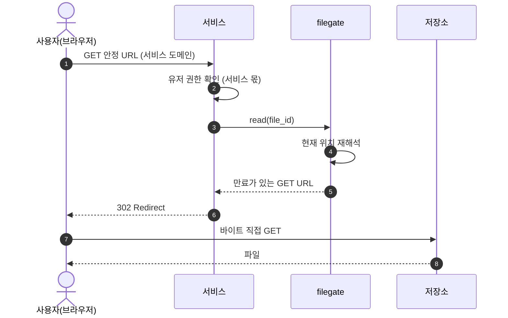

# spec 00: 단일 파일 오퍼레이션

- Status: Draft
- Date: 2026-07-07
- 근거: ADR [000](../adr/000-identity.md), [001](../adr/001-multi-provider.md), [002](../adr/002-lease-model.md), [003](../adr/003-url-ownership.md), [004](../adr/004-config-layers.md)
- 실측: 2026-07-08, MinIO 싱글노드(마지막 커뮤니티 릴리스). "(실측)" 표기는 이 확인에서 나온 사실이다

이 문서는 filegate가 이번 범위에서 지원하는 오퍼레이션을 정한다. 단일 파일 업로드와 다운로드, 그에 필요한 조회와 삭제, 그리고 운영자의 용량 조회를 다룬다.

## 범위

지원한다:

- 단일 파일 업로드 (`create` → `commit`)
- 단일 파일 다운로드 (`read`)
- 조회 (`stat`)
- 삭제 (`delete`)
- 사용량 조회 (`usage`, 운영자 표면)

접근 모드는 둘 다 지원한다:

- **직결**이 기본이다. 계약 테스트의 기준도 직결이다.
- **중계**는 provider capability가 강제할 때 자동으로 쓰인다. 서비스 계약은 두 모드에서 같다.
- 모드는 provider·오퍼레이션 단위 capability 선언으로 결정된다 (ADR 001). 서비스는 선택하지 않는다.

이번 범위의 provider는 둘이다:

| provider | adapter | 모드 |
|---|---|---|
| MinIO | S3 호환 | 직결 (계약 기준) |
| 로컬 파일시스템 (NFS 마운트) | fs | 중계 전용 (presigned 개념 없음) |

OCI 등 외부 벤더는 다음 범위다. 벤더별 사실은 [docs/vendors/](../vendors/README.md)를 본다.

지원하지 않는다 (다음 범위):

- 폴더·배치 업로드. 폴더는 filegate 개념이 아니다. 필요하면 서비스가 단일 업로드를 반복한다 (ADR 000 공리 1).
- 갱신·재개(resumable) 업로드.
- 단일 PUT 한계(5GiB)를 넘는 파일. multipart는 다음 범위다 — multipart의 ETag는 MD5가 아니라서 체크섬 대조는 단일 PUT에서만 성립한다 (실측).
- 명시적 lease 취소. pending은 lease 만료로만 회수한다. 발급 전 취소가 필요해지면 다음 범위에서 오퍼레이션으로 추가한다.
- 위임 토큰.
- 클라이언트별 quota 집행. 도입하더라도 운영자 내부 가드레일이며 클라이언트에게 노출되지 않는다.

## 공통 원칙

- 권한 검사는 서비스가 오퍼레이션 호출 전에 한다. filegate에는 유저 개념이 없다 (공리 1).
- 바이트는 전송 주체와 저장소 사이에서 직접 오가는 것이 기본이다. filegate는 발급·기록·검증만 한다 (공리 2). 직접이 불가능한 provider는 filegate가 중계한다 — 계약은 같다.
- 서비스가 영속화하는 filegate 산출물은 file_id뿐이다. URL은 저장하지 않는다 (ADR 003).
- 모든 오퍼레이션은 등록된 클라이언트 인증 뒤에 있다. 예외는 둘 — 중계 바이트 엔드포인트는 lease별 secret으로, usage는 운영자 인증으로 지킨다. 익명 표면은 없다 (ADR 003).
- 용량은 운영자의 세계다. 클라이언트는 어떤 오퍼레이션에서도 용량 정보를 받지 않는다. 자기 사용량 관리가 필요한 서비스는 스스로 한다 (공리 1). 이번 범위의 회계는 capacity(provider별 물리 총량) 한 축이다.

## 오퍼레이션

### create

쓰기 lease를 발급한다.

- 입력: intent, 선언 크기. 선택: content_type, 선언 MD5.
  - content_type은 지정하면 서명에 포함되어 강제된다. 서명 밖의 타입 제약은 성립하지 않는다 (실측).
  - 선언 MD5는 commit의 체크섬 대조에 쓴다. 단일 PUT의 ETag = MD5라서 성립한다 (실측).
- 0바이트도 유효한 선언이다.
- 처리: 배치 결정, capacity 예약, file_id 발급.
- capacity는 경성 상한이다: 예약량 + 확정량 + purge 대기 점유 + 이번 선언 크기가 상한을 넘으면 발급하지 않는다. purge 대기 점유를 세는 이유는 용량 = 물리적 점유(purge 전까지)이기 때문이다 (ADR 002). 모든 후보 provider가 상한에 걸리면 create는 실패한다. 거부 이유의 용량 상세는 클라이언트에 노출하지 않는다.
- 출력: file_id, 만료가 있는 PUT URL. URL 구조는 계약이 아니다 — 직결이면 저장소 presigned, 중계면 filegate 바이트 엔드포인트다.
- 상태: 파일은 `pending`. commit 전까지 파일이 아니며, lease 만료 시 회수된다. 회수 시 예약한 capacity를 해제한다.

### commit

업로드를 확정한다.

- 입력: file_id.
- 처리: 저장소 실물 크기를 선언 크기와 대조하고 정산한다. 선언 MD5가 있으면 ETag와도 대조한다. 확정 시점의 ETag를 기록한다.
- 출력: 확정 결과.
- 상태: `pending` → `active`. 검증 실패 시 확정하지 않는다. 파일은 `pending`에 남아 lease 만료까지 재시도할 수 있고, 만료되면 회수된다.
- 쓰기 URL은 확정 후에도 만료 전까지 재사용될 수 있다 (실측). 쓰기 TTL을 짧게 두고, 변조 의심은 기록된 ETag와 대조해 판정한다.

### read

읽기 lease를 발급한다.

- 입력: file_id. 선택: 표현(파일명, 표시 방식) — RFC 5987(`filename*=UTF-8''…`)로 인코딩해 넘긴다 (ADR 003, 실측).
- 처리: 현재 location을 재해석한다. 파일이 이동했어도 같은 file_id로 접근한다.
- 출력: 만료가 있는 GET URL. 서비스는 이 URL로 302 redirect한다. URL 구조는 계약이 아니다.
- 읽기는 용량을 소비하지 않는다.

### stat

파일 메타데이터를 조회한다.

- 입력: file_id.
- 출력: 상태(`pending` | `active` | `deleted`), 크기, intent. location과 URL은 반환하지 않는다.
- 클라이언트는 자기 소유 file_id만 조회한다.

### delete

삭제를 결정한다.

- 입력: file_id.
- 처리: 서비스의 detach 결정을 기록한다. 실제 물리 purge는 reconciler가 요청 경로 밖에서 집행한다 (ADR 000 결정·집행 분리).
- 상태: `active` → `deleted`. 이후 read·commit은 실패한다.
- 정산: capacity는 purge 시점에 해제한다. purge는 멱등하다 — 없는 객체 삭제는 에러가 아니다 (실측).

### usage

운영자 관점의 용량 총량을 조회한다. provider마다 지금 대략 얼마나 저장돼 있는지가 질문이다.

- **운영자 표면이다. 클라이언트 API가 아니다.** 클라이언트 자격증명으로는 호출할 수 없다. 인증 방식은 구현의 영역이다.
- 입력: 없음.
- 출력: provider별 — capacity 한도, 예약량(pending 합), 확정량(active 합), purge 대기 점유(deleted이지만 미purge), 남은 여유. 남은 여유는 이 셋을 모두 뺀 값이다.
- 회계 시점: 예약은 create, 정산은 commit, 해제는 purge 또는 pending 만료 회수에서 일어난다 (ADR 004). delete는 상태만 바꾸고 점유는 유지한다 — purge까지 물리 점유가 남기 때문이다.
- 이 총량이 배치 거부와 tiering 판단의 입력이다.

## 흐름: 업로드

아래 흐름은 직결 모드다. 중계 모드에서는 저장소(O) 자리에 filegate의 바이트 엔드포인트가 서고, 단계와 계약은 같다.


## 흐름: 다운로드

업로드와 같은 원칙이다: 아래는 직결 모드고, 중계 모드에서는 저장소(O) 자리에 filegate의 바이트 엔드포인트가 선다.



## 상태

```text
create ──▶ pending ──commit──▶ active ──delete──▶ deleted ──purge──▶ (해제)
             │                                        (reconciler)
             └── lease 만료 ──▶ 회수
```

- `pending`: 발급됨, 미확정. capacity 예약 상태. 검증 실패한 commit도 여기 남는다 — 별도 실패 상태는 두지 않고 lease 만료 회수로 정리한다.
- `active`: 확정됨. read 가능.
- `deleted`: detach 결정됨. read·commit 실패. purge 대기. purge 전까지 capacity를 계속 점유한다.
- 예약한 capacity는 두 지점에서 해제된다: pending의 lease 만료 회수, deleted의 purge. commit은 예약을 확정으로 정산한다.

## 경계선

- create와 commit은 별개 호출이다. 업로드 한 번은 호출 두 번이다.
- 직결 PUT은 크기를 앞단에서 막지 못한다 (실측). commit이 사후 검증 게이트다 (POST policy는 업로드 시점 크기 강제가 가능하나 지원 편차가 있다). 상한을 넘는 실물은 파일이 될 수 없다 — commit이 거부하고 reconciler가 회수하며, 회수 전까지 초과 바이트가 잠시 물리적으로 존재할 수 있다. 중계 모드는 선언 크기에서 스트림을 차단한다.
- 전송 주체는 Content-Length를 보내야 한다. 길이 미상(chunked) 전송은 저장소가 거부한다 (실측).
- 중계 바이트 엔드포인트의 상세(PUT/GET/OPTIONS, CORS 응답, 스트림 중 크기 차단, fs의 임시 경로 + rename 원자성)는 spec 01로 둔다.
