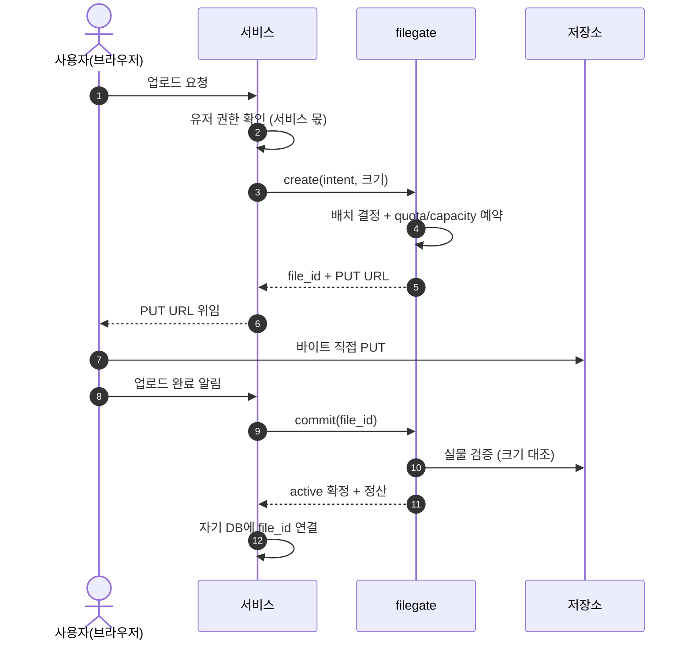
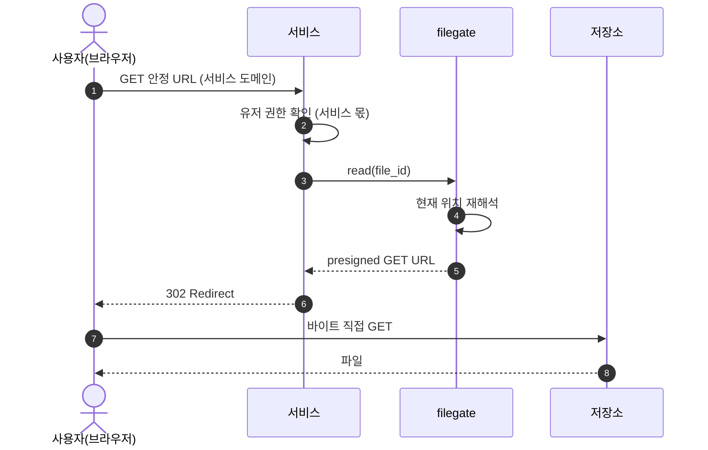

# spec 00: 단일 파일 오퍼레이션

- Status: Draft
- Date: 2026-07-07
- 근거: ADR [000](../adr/000-identity.md), [002](../adr/002-lease-model.md), [003](../adr/003-url-ownership.md)
- 실측: 2026-07-08, MinIO 싱글노드(마지막 커뮤니티 릴리스). "(실측)" 표기는 이 확인에서 나온 사실이다

이 문서는 filegate가 이번 범위에서 지원하는 오퍼레이션을 정한다. 단일 파일 업로드와 다운로드, 그리고 그에 필요한 조회와 삭제만 다룬다.

## 범위

지원한다:

- 단일 파일 업로드 (`create` → `commit`)
- 단일 파일 다운로드 (`read`)
- 조회 (`stat`)
- 삭제 (`delete`)

지원하지 않는다 (다음 범위):

- 폴더·배치 업로드. 폴더는 filegate 개념이 아니다. 필요하면 서비스가 단일 업로드를 반복한다 (ADR 000 공리 1).
- 갱신·재개(resumable) 업로드.
- 위임 토큰, 중계 모드.

배치는 이번 범위에서 단일 provider다. 프로덕션은 oci-std, 로컬 개발은 MinIO다. 벤더별 사실은 [docs/vendors/](../vendors/README.md)를 본다.

## 공통 원칙

- 권한 검사는 서비스가 오퍼레이션 호출 전에 한다. filegate에는 유저 개념이 없다 (공리 1).
- 바이트는 전송 주체와 저장소 사이에서 직접 오간다. filegate는 발급·기록·검증만 한다 (공리 2).
- 서비스가 영속화하는 filegate 산출물은 file_id뿐이다. URL은 저장하지 않는다 (ADR 003).
- 모든 오퍼레이션은 등록된 클라이언트 인증 뒤에 있다. 익명 API는 없다.

## 오퍼레이션

### create

쓰기 lease를 발급한다.

- 입력: intent, 선언 크기. 선택: content_type, 선언 MD5.
  - content_type은 지정하면 서명에 포함되어 강제된다. 서명 밖의 타입 제약은 성립하지 않는다 (실측).
  - 선언 MD5는 commit의 체크섬 대조에 쓴다. 단일 PUT의 ETag = MD5라서 성립한다 (실측).
- 처리: 배치 결정, quota와 capacity 예약, file_id 발급.
- 출력: file_id, PUT URL (저장소 presigned).
- 상태: 파일은 `pending`. commit 전까지 파일이 아니며, lease 만료 시 회수된다.

### commit

업로드를 확정한다.

- 입력: file_id.
- 처리: 저장소 실물 크기를 선언 크기와 대조하고 정산한다. 선언 MD5가 있으면 ETag와도 대조한다. 확정 시점의 ETag를 기록한다.
- 출력: 확정 결과.
- 상태: `pending` → `active`. 검증 실패 시 확정하지 않는다.

### read

읽기 lease를 발급한다.

- 입력: file_id.
- 처리: 현재 location을 재해석한다. 파일이 이동했어도 같은 file_id로 접근한다.
- 출력: presigned GET URL. 서비스는 이 URL로 302 redirect한다.
- 읽기는 용량을 소비하지 않는다.

### stat

파일 메타데이터를 조회한다.

- 입력: file_id.
- 출력: 상태(`pending` | `active` | `deleted`), 크기, intent. location과 URL은 반환하지 않는다.
- 클라이언트는 자기 소유 file_id만 조회한다.

### delete

삭제를 결정한다.

- 입력: file_id.
- 처리: 서비스의 detach 결정을 기록한다. 실제 물리 purge는 reconciler가 요청 경로 밖에서 집행한다 (ADR 000 결정·집행 분리).
- 상태: `active` → `deleted`. 이후 read·commit은 실패한다.
- 정산: quota와 capacity는 purge 시점에 해제한다.

## 흐름: 업로드



## 흐름: 다운로드



## 상태

```text
create ──▶ pending ──commit──▶ active ──delete──▶ deleted ──purge──▶ (해제)
             │                                        (reconciler)
             └── lease 만료 ──▶ 회수
```

- `pending`: 발급됨, 미확정. quota/capacity 예약 상태.
- `active`: 확정됨. read 가능.
- `deleted`: detach 결정됨. read·commit 실패. purge 대기.

## 경계선

- create와 commit은 별개 호출이다. 업로드 한 번은 호출 두 번이다.
- 직결 PUT은 크기를 앞단에서 막지 못한다. commit이 사후 검증 게이트다 (presigned PUT 기준. POST policy는 업로드 시점 크기 강제가 가능하나 지원 편차가 있다).
- 쓰기 URL은 commit 후에도 만료 전까지 재사용될 수 있다 (실측). 쓰기 TTL을 짧게 두고, 변조 의심은 commit이 기록한 ETag와 대조해 판정한다.
- 전송 주체는 Content-Length를 보내야 한다. 길이 미상(chunked) 전송은 저장소가 거부한다 (실측).
- 0바이트 파일은 허용한다. 선언 크기 0도 유효한 선언이다.
- 파일명 표현은 RFC 5987(`filename*=UTF-8''…`)로 인코딩해 넘긴다.
- 단일 PUT 한계(5GiB)를 넘는 선언 크기는 이번 범위 밖이다. multipart는 다음 범위이며, multipart의 ETag는 MD5가 아니므로 체크섬 대조는 단일 PUT에서만 성립한다 (실측).
- 삭제는 결정만 동기다. 물리 purge와 용량 해제는 reconciler가 비동기로 집행한다. purge는 멱등하다 — 없는 객체 삭제는 에러가 아니다 (실측).
